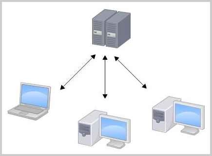
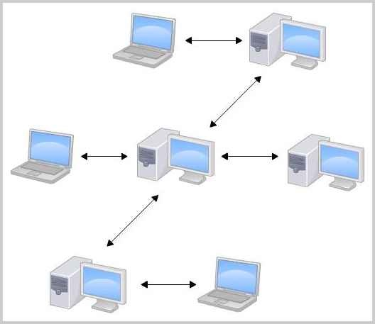

# Git 学习
> 教程来源：廖雪峰的 Git 教程 https://www.liaoxuefeng.com/wiki/
> 分享人：zengqingqing
> 日期：2026-03-11

## 核心问题
- Git 是什么？
- 为什么要使用 Pencil 还原设计稿？
- 为什么要将设计工作流搬到 Git ?
- 现阶段重点是做什么？

## Git 是什么？
Git 是目前世界上最先进的分布式版本控制系统
集中式 VS 分布式





## 为什么要使用 pencil 还原设计稿？
> 版本控制系统的适用范围：TXT 文件、HTML / CSS、程序代码等。
> 二进制文件的限制：图片、视频等属于二进制文件。虽然也可以被 Git 管理，但无法追踪具体内容变化。系统只能记录文件整体发生变化，例如：文件大小从 100KB，变成 120KB，无法知道具体修改了哪一部分内容。

本质区别：
- 图片式设计 = 视觉产物，无法被精确 Diff。
- 结构化（例如组件化、Token 化、JSON 化）设计 = 可追踪的系统规格


## 为什么要将设计工作流搬到 Git ?
把设计搬到 Git，不是为了「方便管理文件」。而是为了让设计进入工程体系，成为可版本化、可审查、可验证的系统规格。

#### 一、版本管理：让设计变成「可追溯资产」
**1.1 设计不再是 V1.0 / V1.1 的文件堆积，Git 能自动记录每一次改动：**
- 不需要复制多个文件版本
- 不需要人工标注「最终版-终极-真的最终」
- 所有改动都天然可回溯

**1.2 可以精确查看某次改动（Diff：Difference），开发可以看到：**
- 哪个组件/字段/尺寸/交互改了
- 这对工程极其友好

**1.3 在 Figma 里：**
- 我们通常把所有内容堆在一个大文件里
- 文件加载慢，微小改动难以追踪
- 没有规范化 PR 流程，改动原因缺少说明
- 组件引用混乱

> 最终导致：
> 设计变更是「感知型」的，而不是「结构型」的。

**1.4 Git + PR 可以强制形成：**
- 改动说明
- 审核流程
- 变更记录
- 责任清晰
- 设计开始具备「工程属性」


#### 二、安全左移
- 安全左移（Shift Left Security）：把安全工作从开发后期，前移到开发早期甚至设计阶段。
> 「左移」这个说法来自软件生命周期流程图：
> 需求 → 设计 → 开发 → 测试 → 上线 → 运维
> ↑ 左边是更早阶段

- 设计变成「系统规格」的一部分，设计走查变成像单元测试一样「必须通过」的环节了，这本质是一种：设计左移（Design Shift Left），这种左移给系统带来了「端到端」试错的能力。

## 现阶段的重点工作
1. 跑通工作流，最小的试错成本
2. 达成共识：不改变团队成员的职能（前端拿到 Pencil 文件还是跟拿到 Figma 文件一样开始工作）只是改变协作方式（Gi+PR）
3. 约定哪些文档是前端可用的（README）

## 学习使用
#### 1. 安装 Git
```
 brew install git
```
并配置 Git 的用户名和邮箱

#### 2. 创建版本库
##### 2.1 在空目录下创建 Git 仓库
版本库（Repository，简称 Repo）可以理解为一个被 Git 管理的目录。
在这个目录中：
- 所有文件的新增、修改、删除都会被记录
- 每一次变更都可以追溯
- 可以在未来任意时间「回滚」到某个历史版本

在我的Mac上，这个仓库位于 /Users/zengqingqing/workspace/builder

-------

```.git``` 是什么？
当你创建版本库后，目录中会生成一个隐藏文件夹```.git```，它是 Git 用来记录版本信息的核心目录。

⚠️ 不要手动修改 ```.git``` 里的内容，否则可能会破坏仓库
如果想查看隐藏文件，可以使用：用```ls -ah```命令就可以看见。


##### 2.2 把文件添加到版本库
编写一个 ```readme.txt``` 文件，内容如下
```
Git is a version control system.
Git is free software.
```
放到 ```builder``` 目录下

第一步，用命令```git add```告诉 Git，把文件添加到仓库：
```
git add readme.txt
```

第二步，用命令 ```git commit```告诉 Git，把文件提交到仓库：
```
git commit -m "wrote a readme file"
[master (root-commit) eaadf4e] wrote a readme file
 1 file changed, 2 insertions(+)
 create mode 100644 readme.txt
```

解释```git commit```命令，```-m``` 后面输入的是本次提交的说明，方便从历史记录里方便地找到改动记录。

```git commit``` 命令执行成功后会告诉你，```1 file changed```：1个文件被改动（我们新添加的 readme.txt 文件）；```2 insertions```：插入了两行内容（readme.txt 有两行内容）。

#### 3. 时光机穿梭
##### 3.1 版本回退

##### 小结
- 要随时掌握工作区的状态，使用```git status```命令
- 如果```git status```告诉你有文件被修改过，用```git diff```可以查看修改内容
- ```git status``` → ```git add``` → ```git commit -m"xxxxx"``` → ```git status```
- 当你不断修改文件，并提交到版本库时，Git 会为当前状态保存一个「快照」，这个快照叫做 commit。每一次 commit，都是一次可回溯的版本记录。

-------

##### 版本回退步骤

修改  ```readme.txt ``` 文件，改成如下内容:
```
Git is a distributed version control system.
Git is free software.
```

现在，运行```git status```命令看看结果：
```
git status
On branch master
Changes not staged for commit:
  (use "git add <file>..." to update what will be committed)
  (use "git checkout -- <file>..." to discard changes in working directory)
	modified:   readme.txt
no changes added to commit (use "git add" and/or "git commit -a")
```

运行 ```git diff```这个命令看看 different：
```
git diff readme.txt 
diff --git a/readme.txt b/readme.txt
index 46d49bf..9247db6 100644
--- a/readme.txt
+++ b/readme.txt
@@ -1,2 +1,2 @@
-Git is a version control system.
+Git is a distributed version control system.
 Git is free software.

```

提交修改和提交新文件是一样的两步，第一步是 ```git add```
```
git add readme.txt
```

第二步```git commit```之前，我们再运行```git status```看看当前仓库的状态：
```
git status
On branch master
Changes to be committed:
  (use "git reset HEAD <file>..." to unstage)

	modified:   readme.txt
```
```git status```告诉我们，将要被提交的修改包括 ```readme.txt```，下一步，就可以放心地提交了：
```
git commit -m "add distributed"
[master e475afc] add distributed
 1 file changed, 1 insertion(+), 1 deletion(-)
```
提交后，我们再用```git status```命令看看仓库的当前状态：
```
 git status
On branch master
nothing to commit, working tree clean
```

```git log```命令显示从最近到最远的提交日志，我们可以看到3次提交，最近的一次是 append GPL，上一次是 add distributed，最早的一次是 wrote a readme 

##  未完待续...


## 工作场景
### 场景一 提交文件夹到 git
我在 ~/workspace/h 内有两个文件夹 a b 的数据 我需要提交到 git

#### 第一步：确认当前目录是仓库，先进入 h:
``` 
cd ~/workspace/h
``` 
确认一下：
``` 
ls -a
``` 
必须看到
``` 
.git
``` 
#### 第二步：查看当前状态

``` 
git status
``` 
如果 a 和 b 还没被 Git 管理，会看到：
``` 
Untracked files:
  a/
  b/
``` 
#### 第三步：添加到暂存区
如果要一次性提交全部内容：
``` 
git add .
``` 
如果只想提交 a 和 b：
``` 
git add a b
``` 
#### 第四步：确认已进入暂存区

```
git status 
``` 
应该看到：

``` 
Changes to be committed:
  new file: a/xxx
  new file: b/xxx
``` 

#### 第五步：提交
```
git commit -m "add folders a and b"
``` 

#### 推到 GitHub
先确认是否有远程仓库：
```
git remote -v
``` 
如果已经连接了远程：
```
git push origin main
``` 

### 场景二 Review pr
#### 第一步：切分支
首先切换到跟踪分支：upstream/ui（即 goplus/builder/ui）

#### 第二步：拉取 pr 内容
git fetch upstream pull/2890/head:pr_2890
2890（指的是pr编号）
pr_2890（用于review的分支名，新建的分支与 pr 号绑定，方便识别）

#### 第三步：切换到新建的分支
git checkout pr_2890

### 场景三 将 Review 数据保存在本地，进行修改，然后同步到远端
在 pr_2890 的基础上进行修改，并同步到 upstream pull/2890

#### 第一步：保存到本地仓库
git add .
git commit -m"您的提交信息描述"

```
工作区 (Working Directory)
    ↓ git add .
暂存区 (Staging Area) 
    ↓ git commit
本地仓库 (Local Repository) ← 📌 数据在这里
    ↓ git push
远程仓库 (Remote Repository)   ← GitHub/GitLab 等

```
#### 第二步：推送到远程仓库
由于您有一个 fork 仓库。配置：
origin: 您的 fork (qingqing-ux/builder)
upstream: 原始仓库 (goplus/builder)

方案一：通过 origin 创建 PR 到 upstream
这是最常见的工作流程：

#### 1. 推送到您的 fork
git push origin pr_2890

#### 2. 然后在 GitHub 上创建 Pull Request
从 qingqing-ux/builder:pr_2929 
到   goplus/builder:dev

### 场景四 在电脑初始化 git 仓库
#### 在电脑中
建立文件夹
第一步：cd /Users/zengqingqing/workspace/
第二步：新建文件夹 <文件夹名称>


#### 在终端中
在指定目录建立文件夹

#### 先进入目录，再创建
cd  /Users/zengqingqing/workspace/

- 创建一个文件夹
  mkdir  test    
  > mk = make（创建）
  dir = directory（目录 / 文件夹）

- 创建一个 .md 文件
  touch test.md

- 创建并直接写入内容
  echo "# 标题" > test.md
  > echo 👉 输出内容
  > ">" 👉 重定向到文件
    test.md 👉 文件名

- 打印当前工作目录
  pwd
  
#### 查看是否创建成功
进入项目目录
cd /Users/zengqingqing/workspace/<文件夹名称>
ls

#### 初始化仓库
git init

成功后 git status 会看到
一个 .git 目录

#### 在 Finder 中显示 .git
Command + Shift + .


### 场景五 通过展示 .git 内文件变化，理解数据结构
进入工作区
初始化 git 仓库
建立 a.md 文件 → 观察 hash 变化
建立 文件夹 b 包含 a.md  件 → 观察 refs(当前引用的commit） 变化 → 观察 HEAD(当前分支）变化
试试更改 hash 可以替换内容
查看文件 git cat-file -p 
git 有三种不同的存储类型，commit、tree、blob，
git commit 会带上 tree、父commit、author

### 场景六 了解远程协作
在 qingqing-ux 账号下 fork 一个 builder 仓库 下的 ui 分支
git remote -v 查看远程仓库地址
会有两个概念 
origin  git@github.com:qingqing-ux/builder.git (your fork)
upstream        https://github.com/goplus/builder.git (the original repository)

#### 同步 upstream 的 ui 分支

1. 切换到 ui 分支
git checkout ui

2. 从 upstream 拉取最新更改
git fetch upstream

3. 将 upstream/ui 合并到本地 ui 分支
git merge upstream/ui

> git merge upstream/dev     # 合并 upstream 的 dev 分支,到当前分支
> git merge origin/dev       # 合并 origin 的 dev 分支,到当前分支
> git merge dev              # 合并本地的 dev 分支,到当前分支


4. 推送到你的 origin 仓库
git push origin ui

#### 将数据从 origin 同步到 upstream
方法 1：使用 GitHub CLI

1. 确保你的分支已推送到 origin
git push origin paper-test
> paper-test 是你当前所在的 git 分支名称

2. 创建 PR 到 upstream
gh pr create --repo goplus/builder --base ui --head qingqing-ux:paper-test
> gh pr create - 创建 Pull Request
> --repo goplus/builder - 指定 PR 要合并到哪个仓库,这里是 upstream 仓库（原始仓库）
> --base ui - 指定目标分支（PR 要合并到哪个分支）
> --head qingqing-ux:paper-test - 指定源分支（从哪个分支发起 PR）,paper-test 是你的功能分支


## git 常用命令
 git add .
 git commit -m'xxxxx'
 git status
 
 git fetch 下载远程更新
 git push 下载 + 合并
 git pull 上传到远程
 
#### Git 是一个内容寻址数据库
在 git 的时候，所有的文件都是独立，靠引用，commit tree blob 存在
Git 是一个内容寻址数据库，靠哈希值组织一套对象系统

#### .git 内文件夹
###### cat .git/HEAD
 > 当前指针
``` 
ref: refs/heads/main
```
指的是：正在 main 分支上工作

###### cat .git/objects
> 存有所有数据内容，三种核心对象类型 包含 blob、tree、commit

执行
``` 
touch a.txt
git add .
git commit -m "first"
``` 
Git 会
1. 创建 blob（a.txt 的内容）
2. 创建 tree（当前目录结构）
3. 创建 commit（记录作者 + 时间 + 指向 tree）
4. 存入 .git/objects

###### cat .git/refs
存有分支和标签
各个分支指向哪个 commit
``` 
 .git/refs/heads/main
 
``` 

#### Git 有三个区域
工作区（Working Directory）
        ↓ git add
暂存区（Staging Area）
        ↓ git commit
版本库（Repository）

